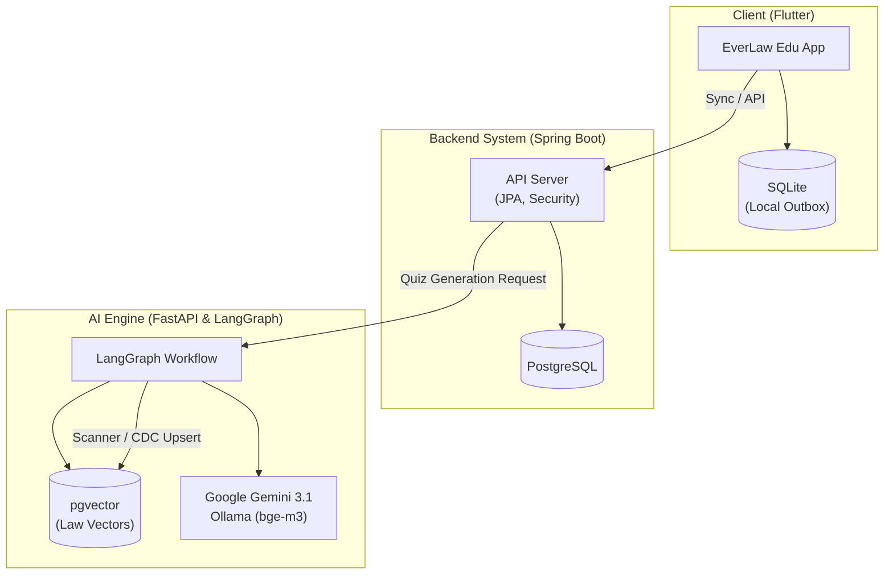

# 🛡️ EverLaw Edu (에버로 에듀)

> **"가장 신선한 법령으로, 가장 정확한 교육을 — 실시간 법령 기반 콘텐츠 생산 공장"**

EverLaw Edu는 실시간으로 갱신되는 국가 표준 법령 DB를 지식의 원천(Source of Truth)으로 삼아, 기업의 컴플라이언스 및 의무 교육 콘텐츠(시나리오, 퀴즈)를 자율적으로 생성하고 관리하는 **AI 기반 교육 콘텐츠 자동화 솔루션**입니다.

---

## 🚀 프로젝트 개요 (Overview)

기존 의무 교육 콘텐츠의 수동 교정 방식과 파편화된 문서 포맷의 한계를 극복하기 위해 설계되었습니다.
국가 표준 법령 전문을 벡터 DB에 항상 최신 상태로 유지하며, 이를 근거로 4지선다형 모의 퀴즈를 무(無)에서 유(有)로 자동 창작하는 스마트 팩토리 모델을 제시합니다.

### 💡 핵심 가치
1. **절대적 팩트 신뢰도 (Absolute Truth)**: 법령 원본 텍스트를 RAG 지식 소스로 사용하여 교육 팩트 오류 원천 차단.
2. **자율적 콘텐츠 대량 생산 (Generative Scalability)**: 단순 조문 텍스트를 스토리텔링과 가상 현장 시나리오가 가미된 퀴즈로 자동 변환.
3. **비즈니스 콜드 스타트 제거 (SaaS Ready)**: 기존 문제 은행이 없어도 최신 법령 DB를 통해 즉시 양질의 교육 자료 배포 가능.

---

## ✨ 핵심 기능 (Key Features)

### 🤖 1. AI 에이전트 워크플로우 (AI Engine)
- **실시간 법령 DB 스캐너**: 국가법령정보센터 및 GitHub 커밋을 감지하여 실시간 및 Daily 스케줄링으로 법령 변경 사항을 추적합니다.
- **스마트 CDC & SQL-level Upsert**: SHA-256 해시 대조를 통해 변경된 '조(Article)' 단위만 정밀하게 분할(Chunking)하여 벡터 DB(pgvector)에 물리적으로 갱신(선삭제 후 삽입)합니다.
- **듀얼 모드 콘텐츠 생산기**:
  - **모드 A (벌크 빌더)**: 최초 시딩 시 전체 조항에 대해 4지선다형 퀴즈 대량 생산 (조항당 5제 일괄 출제).
  - **모드 B (델타 핫스왑)**: 법령 개정 감지 시 해당 조항과 연결된 기존 퀴즈를 AI가 자동으로 리라이팅 및 최신화.
- **AI 자가 검증 (Auto-Validation)**: 생산된 퀴즈의 규제 수치와 팩트가 원본과 100% 일치하는지 교차 검증 (환각율 0.0% 지향).

### 👨‍💻 2. 학습자 경험 (Learner UX)
- **스토리텔링형 4지선다 퀴즈**: 현장 사례를 바탕으로 한 지문, 매력적인 오답, 힌트, 그리고 상세 해설을 제공하여 실무 적용력을 높입니다.
- **컨텍스트 바인딩 AI 챗봇**: 오답 시 상세 해설과 함께 인라인 AI 채팅창이 노출되며, 틀린 문제의 문맥(법령, 지문, 선택한 오답)이 자동으로 챗봇에 연동되어 1:1 맞춤형 과외를 제공합니다.
- **지능형 오답노트 & 자동 졸업 (Mastery System)**: 
  - 학습자의 오답 데이터를 바탕으로 가장 취약한 법령 조항을 분석합니다.
  - **Adaptive AI Quiz Clinic**: 취약 조항에 대해 완전히 새로운 시나리오의 변형 퀴즈를 실시간(On-the-fly)으로 즉석 생성합니다.
  - 동일 조항의 변형 문제를 연속 3회 정답 처리 시 자동으로 오답노트에서 아카이빙(졸업)하며 취약 지수를 갱신합니다.

### 👮 3. 관리자 시스템 (Admin Control)
- **Side-by-Side 승인 UI**: 좌측엔 최신 법령 팩트, 우측엔 AI가 생산한 퀴즈를 배치하여 직관적인 교차 검증 및 배포 승인을 지원합니다.
- **스냅샷 버전 관리**: 교육 이수 시점의 법적 증빙을 위해 퀴즈의 과거 버전 스냅샷을 영구 보존합니다.

---

## 🏗️ 시스템 아키텍처 및 기술 스택 (Architecture)



### 🛠 Tech Stack
- **Back-end**: Java 25, Spring Boot 3.x, Spring Data JPA, Spring Security, JWT Auth
- **AI Engine**: Python, FastAPI, LangGraph, Google Gemini 3.1 Flash-Lite, Ollama (bge-m3 Embedding)
- **Front-end**: Flutter, Riverpod, Local SQLite / SharedPreferences
- **Database**: PostgreSQL 17 (pgvector), Redis (Cache & Task Queue)
- **Infrastructure**: Docker, Docker Compose

---

## 📂 프로젝트 구조 (Project Structure)

```text
everlaw-edu/
├── ai-engine/             # Python FastAPI 기반 AI 에이전트, RAG 파이프라인, 생성 엔진
├── edu-server/            # Spring Boot 백엔드 (비즈니스 로직, API 제공, JPA 엔티티 관리)
├── edu-client/            # Flutter 모바일/웹 클라이언트 애플리케이션
├── docker-compose.yml     # PostgreSQL(pgvector), Redis, Ollama 컨테이너 오케스트레이션
├── prd.md                 # 제품 요구사항 정의서 (Product Requirements Document)
├── functional_specification.md # 기능 명세 및 시스템 상세 동작 백서
└── implementation_plan.md # 세부 구현 계획 및 작업 내역 (일괄 출제 등)
```

---

## 🏃 실행 방법 (How to Run)

### 1. 인프라 실행 (Database & Redis & Ollama)
루트 디렉토리에서 Docker Compose를 사용하여 필수 인프라를 실행합니다.
```bash
docker-compose up -d
```
*(기본 포트: PostgreSQL 5437, Redis 6384, Ollama 11439)*

### 2. 백엔드 서버 실행 (Spring Boot)
최초 실행 시 `edu-server` 디렉토리 내의 `run-server-example.bat` 파일을 복사하여 `run-server.bat`을 생성합니다. 이후 파일 내의 환경 변수(JWT Secret, Google Client ID 등)를 본인의 환경에 맞게 수정합니다.

환경 변수 설정이 완료되면 배치 스크립트를 통해 서버를 실행합니다.
```cmd
cd edu-server
run-server.bat
```
*(Mac/Linux 환경의 경우 `run-server-example.bat` 파일 내의 환경 변수를 참고하여 터미널에 직접 주입한 후 `./gradlew bootRun`으로 실행해야 합니다)*

### 3. AI 엔진 실행 (FastAPI)
```bash
cd ai-engine
python -m venv venv
# Windows: venv\Scripts\activate
# Mac/Linux: source venv/bin/activate
pip install -r requirements.txt
uvicorn main:app --reload --port 8000
```
*(`.env` 파일에 `GEMINI_API_KEY` 설정 필요)*

### 4. 클라이언트 앱 실행 (Flutter)
```bash
cd edu-client
flutter pub get
flutter run
```
