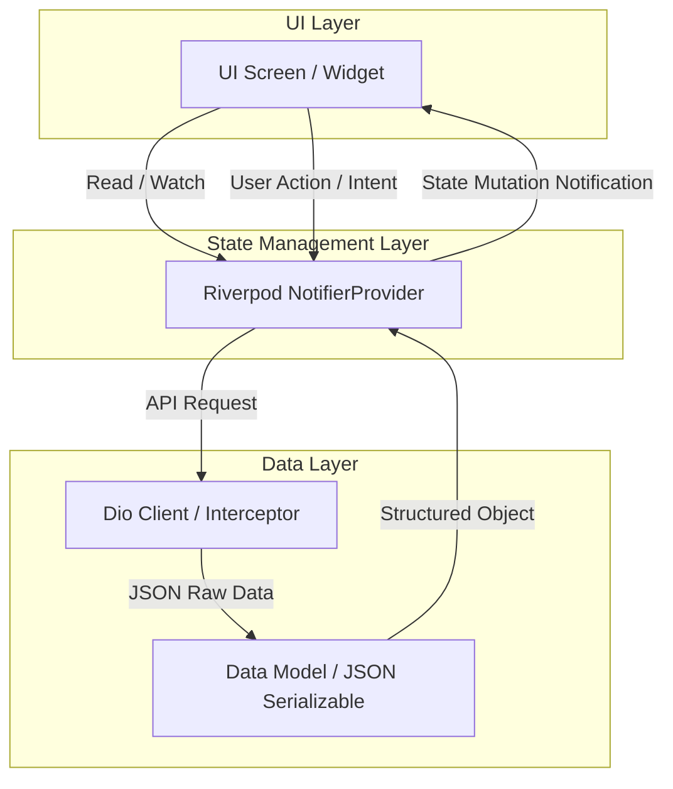

# EverLaw Edu Client (edu_client)

<p align="center">
  
  
  
  
</p>

## 📝 프로젝트 개요

**EverLaw Edu**는 최신 법령 데이터베이스(DB)를 기반으로 기업 및 공공기관의 컴플라이언스(준법 감시) 관리와 맞춤형 교육 콘텐츠를 자율적으로 생산·검증하고 학습할 수 있도록 지원하는 지능형 솔루션입니다. 

`edu-client`는 EverLaw Edu 에코시스템의 핵심 사용자 인터페이스(UI)를 담당하는 Flutter 기반의 멀티플랫폼 클라이언트 애플리케이션입니다. AI가 추천하거나 생성한 교육 콘텐츠 및 가이드라인의 적격성(Compliance)을 검토·승인하는 결재 시스템과, 사용자가 최신 법령 지식을 효과적으로 습득할 수 있는 대화형 레슨 및 퀴즈 환경을 제공합니다.

---

## ✨ 핵심 기능

### 1. AI 컴플라이언스 검증 및 승인 대기열 (`features/approval`)
* **결재 대기열 (Approval Queue)**: AI가 자동 생성한 준법 교육 콘텐츠 혹은 사용자가 요청한 법령 교육 안건에 대해 AI 검증 스코어 및 준법 가이드를 시각적으로 확인하고 승인/반려할 수 있는 워크플로우를 제공합니다.
* **상세 검토 및 AI 피드백**: AI가 분석한 적합성 진단 점수 및 법적 오류 가능성 경고 카드를 통해 관리자의 신속하고 정확한 의사결정을 돕습니다.

### 2. 법령 기반 대화형 학습 환경 (`features/lesson`)
* **지능형 레슨 목록 (Lesson List)**: 최신 법령 개정 사항 및 트렌드를 반영하여 생성된 단계별 준법 교육 목록을 제공합니다.
* **퀴즈 인터랙션 및 마크다운 렌더러**: 복잡한 법률 텍스트를 가독성 높은 마크다운 형태로 렌더링하고, 본문 내에서 즉각적으로 대화형 퀴즈를 풀며 학습 효과를 극대화할 수 있습니다.

### 3. 고성능 공통 아키텍처 및 보안 (`core`)
* **인증 인터셉터 (Auth Interceptor)**: JWT 토큰 기반의 세션 보안을 자동으로 처리하여 안전한 통신 환경을 보장합니다.
* **반응형 레이아웃 (Responsive Layout)**: 모바일, 태블릿, 데스크톱 등 다양한 스크린 크기에 맞춰 일관되고 아름다운 프리미엄 UI를 제공합니다.

---

## 🛠 기술 스택

| 분류 | 기술 / 라이브러리 | 용도 및 특징 |
| :--- | :--- | :--- |
| **Framework** | **Flutter** (SDK >= 3.2.0) | 멀티플랫폼(Android, iOS, Web, Desktop) 고성능 렌더링 엔진 |
| **Language** | **Dart** | 정적 타입 검사 및 효율적인 비동기 프로그래밍 지원 |
| **State Management** | **Flutter Riverpod** & **Riverpod Generator** | 선언적이고 안전한 상태 관리 및 전역 의존성 주입 |
| **Network** | **Dio** | HTTP 통신, Request/Response 인터셉터 및 파일 업로드 처리 |
| **Storage** | **Flutter Secure Storage** | JWT 토큰 및 민감한 로컬 사용자 설정 데이터 암호화 저장 |
| **UI Component** | **Flutter Markdown** | 리치 마크다운 텍스트 렌더링 및 스타일 커스텀 |

---

## 📂 프로젝트 구조

애플리케이션은 **Clean Architecture** 원칙에 영감을 얻은 **Feature-First** 구조로 설계되었습니다. 각 기능(Feature)은 고유한 상태(Provider), 데이터 모델(Model), 화면(View)을 독립적으로 유지하여 유지보수성과 확장성을 극대화합니다.

```directory
lib/
├── core/                         # 애플리케이션 전역에서 공유되는 핵심 인프라 레이어
│   ├── network/                  # 네트워크 통신 및 API 처리
│   │   ├── auth_interceptor.dart # JWT 기반 인증 인터셉터
│   │   └── dio_provider.dart     # 커스텀 Dio HTTP 클라이언트 프로바이더
│   ├── services/                 # 공통 백그라운드 서비스 및 외부 SDK 연동
│   │   └── push_notification_service.dart # 실시간 알림 서비스
│   └── widgets/                  # 애플리케이션 전역에서 사용되는 공통 커스텀 위젯
│       ├── ai_validation_card.dart    # AI 분석 및 법령 검증 대시보드 카드
│       ├── markdown_quiz_renderer.dart # 마크다운 형식의 퀴즈 포함 렌더러 위젯
│       └── responsive_layout.dart      # 반응형 디바이스 스크린 레이아웃
│
├── features/                     # 도메인 및 기능 중심의 피처 레이어
│   ├── approval/                 # AI 콘텐츠 검증 및 준법 승인(결재) 기능
│   │   ├── models/               # 결재 대상 및 이력 모델 정의
│   │   ├── providers/            # 결재 대기열 목록 상태 관리 프로바이더
│   │   └── views/                # approval_queue_screen, approval_detail_screen
│   │
│   └── lesson/                   # 대화형 법률 레슨 및 학습 기능
│       ├── models/               # 레슨 정보 및 퀴즈 엔티티 모델 정의
│       ├── providers/            # 레슨 목록 및 수강 상태 프로바이더
│       └── views/                # lesson_list_screen, lesson_detail_screen
│
└── main.dart                     # 애플리케이션 진입점 및 테마, 루트 라우트 설정
```

---

## 📐 애플리케이션 데이터 흐름



---

## 🚀 시작하기

### 1. 사전 요구사항
* Flutter SDK (최소 v3.2.0 이상 필요)
* Dart SDK (>=3.2.0 <4.0.0)
* IDE: VS Code, Android Studio, 혹은 IntelliJ

### 2. 프로젝트 클론 및 의존성 패키지 다운로드
```bash
# 의존성 패키지 설치
flutter pub get
```

### 3. 코드 생성기(Code Generator) 실행
본 프로젝트는 Riverpod 및 모델 생성 등을 위해 `build_runner`를 사용합니다. 상태 관리 모델 변경 시 아래 명령어를 통해 자동 빌드를 수행해 주십시오.

* **1회성 빌드**
  ```bash
  dart run build_runner build --delete-conflicting-outputs
  ```
* **실시간 변경사항 감시 빌드**
  ```bash
  dart run build_runner watch --delete-conflicting-outputs
  ```

### 4. 애플리케이션 실행
```bash
# 로컬 개발용 디바이스 또는 시뮬레이터에서 실행
flutter run
```

---

## 💎 디자인 시스템 & UX 원칙

EverLaw Edu Client는 사용자에게 신뢰감과 고도의 전문성을 주기 위해 엄격하게 큐레이션된 **Premium Deep Blue** 컬러 스키마를 따릅니다.

* **Primary Color**: `#1E3A8A` (Deep Blue)
* **Background Dark**: `#0F172A` (Slate Dark)
* **Typography**: Modern & Sleek 한 **Inter** 폰트 탑재
* **Micro-Animations**: 법적 심사 및 상태 변경에 따른 인터랙티브 전환 효과 적용
