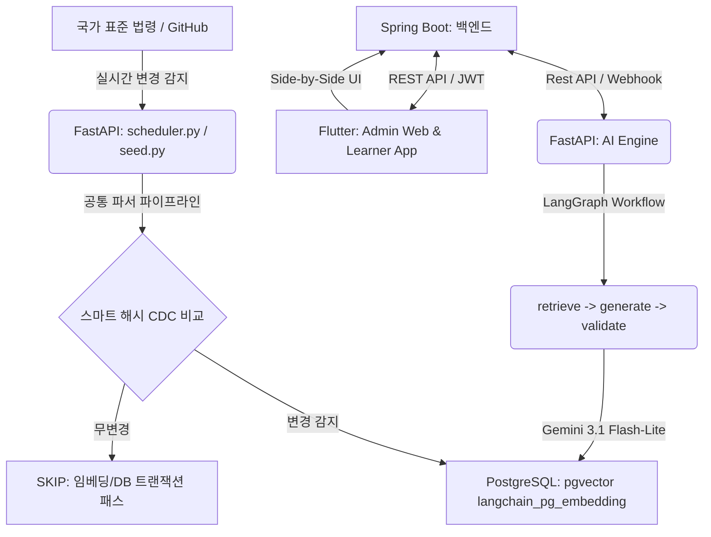

# EverLaw Edu: 최신 법령 DB 기반 교육 콘텐츠 자율 생산 및 컴플라이언스 솔루션
## 🛡️ 시니어 풀스택 엔지니어 아키텍처 분석 및 진단 보고서

본 보고서는 **EverLaw Edu(에버로 에듀)** 프로젝트의 비즈니스 목적, 아키텍처 구성 요소, 핵심 엔지니어링 돌파구(Mechanisms), 현재 개발 진행 상태, 그리고 향후 보완해야 할 아키텍처적 백로그 및 기술 부채를 시니어 풀스택 엔지니어의 관점에서 정밀하게 진단하고 분석한 종합 보고서입니다.

---

## 1. 프로젝트 비전 및 비즈니스 가치 (Business Vision)

EverLaw Edu는 기존 컴플라이언스 및 직무 교육 콘텐츠가 가졌던 **"수동 교정의 높은 비용"**과 **"법령 개정 시의 지체 현상"**, 그리고 **"파편화된 문서 파싱 시의 노이즈 및 오류"**를 기술적으로 완벽히 극복하고자 기획된 고도화된 콘텐츠 스마트 팩토리 플랫폼입니다.

*   **지식의 원천(Source of Truth)**: 국가 표준 법령 DB를 항시 실시간으로 100% 동기화 및 벡터화하여, 지식의 기저에 환각이나 왜곡이 끼어들 여지를 차단합니다.
*   **자율적 대량 생산(Generative Scalability)**: 법령 전문을 마중물 삼아 RAG를 구동하고, LLM을 통해 현장감 넘치는 스토리텔링 강의안과 객관식 모의 평가 퀴즈를 자동으로 창작합니다.
*   **환각율 0.0% 지향**: AI 감사 에이전트(LangGraph Node)를 통해 수치적/법적 의무 사항의 일치 여부를 교차 검증하고 경고 플래그(🔴 Red Flag) 시스템을 가동합니다.
*   **Side-by-Side 검증**: 교육 담당자(Admin)가 원본 법령 팩트(좌)와 생성된 마크다운 교안(우)을 한눈에 대조하여 1초 만에 릴리스를 승인 및 배포할 수 있는 신뢰성 높은 UI를 제공합니다.

---

## 2. 전체 시스템 아키텍처 (System Architecture)

EverLaw Edu는 **Python AI 에이전트 + Spring Boot 백엔드 + Flutter 크로스플랫폼 프론트엔드**가 유기적으로 맞물린 **3-Tier 하이브리드 아키텍처**를 가지고 있습니다.



### 2.1 기술 스택 요약 (Tech Stack)
*   **AI Engine**: FastAPI (Python 3.12), Google Gemini 3.1 Flash-Lite, Ollama (bge-m3 Embedding), LangGraph, LangChain
*   **Back-end**: Spring Boot 3.x (Java 25), Spring Data JPA, Hibernate, PostgreSQL, JWT (인증/인가)
*   **Front-end**: Flutter 3.x (Dart), Riverpod (상태 관리), flutter_markdown (마크다운 동적 렌더러)
*   **Infrastructure**: Local Docker Compose (PostgreSQL, pgvector, Redis)

---

## 3. 핵심 엔지니어링 메커니즘 분석 (Core Engineering Breakthroughs)

이 프로젝트는 RAG 및 LLM 애플리케이션의 고질적인 한계인 **"환각(Hallucination)"**, **"메타데이터 왜곡(Metadata Drift)"**, **"데이터 중복 적재"**, **"컴퓨팅 자원 낭비"**를 해결하기 위해 매우 정밀한 시니어 레벨의 아키텍처적 솔루션을 설계하고 완벽하게 안착시켰습니다.

### 3.1 '조(Article)' 단위 완결 청킹 전략 (Goldilocks Chunking)
*   **문제점**: 기존 RAG에서 널리 쓰이는 단순 캐릭터 수/토큰 수 기반의 물리 청킹(예: 500자 단위 분할)은 법령의 조항 중간을 잘라버려 RAG 검색 시 맥락 단절을 초래하고 AI의 심각한 환각을 유발합니다.
*   **해결책**: 대한민국 법령 마크다운 규격인 `##### 제N조 (제목)` 헤더를 역추적하는 **조(Article) 단위의 물리적 시맨틱 바운더리 독립 청킹**을 수행합니다. 300자~1,500자 사이의 '골디락스 존'에 맞춰 하나의 온전한 조를 하나의 청크로 그대로 벡터 DB에 적재하므로, RAG가 법률 맥락을 손실 없이 정확하게 보존하게 됩니다.

### 3.2 Metadata Drift 방지를 위한 공통 파이프라인 단일화
*   **문제점**: 시스템 초기 적재(Seeding) 로직과 실시간 변경 사항을 반영하는 감시(Scheduler) 로직의 파서가 다르면, 시간이 흐름에 따라 동일 법령의 청크 구조와 메타데이터 구조가 어긋나는 '메타데이터 왜곡' 현상이 발생합니다.
*   **해결책**: 벌크 시딩(`seed.py`)과 실시간 변경 감지 스캐너(`scheduler.py`)가 동일한 조/항/호/목 파서인 `split_law_markdown_to_documents` 함수를 공동 호출하도록 고정함으로써, **영구적으로 일관성 있고 100% 정렬된 RAG 메타데이터 구조**를 유지합니다.

### 3.3 스마트 SHA-256 해시 CDC (Change Data Capture)
*   **문제점**: 매번 법령 파일이 갱신될 때마다 전체 청크의 임베딩을 다시 생성하고 DB를 갱신하면, 막대한 API 호출 비용과 DB 부하가 발생합니다.
*   **해결책**: 각 청크 본문의 `SHA-256` 해시를 추출하여 `cmetadata.chunk_hash` 필드에 함께 저장합니다. 적재 요청 시 데이터베이스의 이전 해시값과 대조하여 완벽하게 일치할 경우 **임베딩 생성 API 호출과 DB Write 트랜잭션 전체를 고속으로 SKIP** 처리하여 자원과 비용을 극적으로 절감합니다. (99%의 무변경 데이터가 SKIP 처리됨)

### 3.4 물리적 멱등성 클렌징 및 PK 충돌 방지 (DELETE & INSERT)
*   **문제점**: LangChain PGVector의 PK 제약 조건 한계로 인해 데이터 갱신 시 중복 레코드가 계속 쌓이거나 쓰레기 데이터로 인해 환각이 증폭될 수 있습니다. 특히 `산업안전보건법 제1조`와 `시행규칙 부칙 제1조`가 동일한 PK를 생성하여 덮어쓰기(Data Loss)가 발생하는 치명적 버그가 존재했습니다.
*   **해결책**: 불변의 고유 비즈니스 키(`law_{law_name}_{law_type}_{article}`)를 정교하게 정의하고 부칙 여부까지 포함시켜 식별자 충돌을 원천 방어했습니다. 해시 변경 감지 시 구버전 레코드를 물리적 SQL-level로 완전히 DELETE(선삭제)한 후 INSERT(후삽입)함으로써 100%의 멱등성과 클린한 DB 상태를 영구 보증합니다.

### 3.5 비조항 청크 붕괴 예방
*   **해결책**: `article` 정보가 추출되지 않는 최상위 헤더나 예외 조항(정의, 부칙 등)에 대해서도 `seed_{law_name}_{law_type}_{chunk_idx}`와 같은 **결정론적 대체 키(`law_id`)**를 생성하여 실시간 스캔과 시딩 간의 키 충돌과 누실을 완벽히 방어합니다.

---

## 4. LangGraph 기반 자율 생산 및 자가 검증 워크플로우

프로젝트의 AI 두뇌는 단순한 LLM 프롬프트 호출을 넘어 **자가 검증 감사 루프가 적용된 LangGraph 에이전트 시스템**을 구축했습니다.

```
[Retrieve 노드] ──> [Generate 노드] ──> [Validate 노드] ──> [END]
  (RAG 법령 검색)    (시나리오/퀴즈 창작)   (수치/의도 일대일 감사)
```

1.  **Retrieve Node**: `law_documents` 컬렉션의 가장 신선한 법령 전문을 의미론적으로 검색하여 Context 확보 (Ground Truth 수립).
2.  **Generate Node**: 구조화된 출력(Structured Output) 스키마(`CurriculumGeneration` Pydantic 모델)를 사용하여, 단순 법령 나열이 아닌 가상 사고 시나리오 및 행동 수칙 스토리텔링이 가미된 풍부한 마크다운 강의안과 4지선다형 모의 퀴즈를 동적으로 자율 생성.
3.  **Validate Node**: 생성된 결과물을 원본 법령 원천 데이터와 일대일로 대조 감사(`ContentValidation` 스키마). 법령의 수치(예: 높이 2m)가 단 1%라도 어긋나거나 왜곡될 경우 환각 지수(Hallucination Score)를 부과하고 반려(Red Flag) 경고를 점등하며 상세 감사 소견을 마크다운 최하단에 강제 접합.

---

## 5. 현재 개발 진척도 진단 (Current Status)

현재 프로젝트는 핵심 모듈의 구현과 핵심 비즈니스 로직 연동이 매우 성공적으로 완료된 고도화된 상태입니다.

| 컴포넌트 | 현재 개발 완료된 핵심 사양 및 상태 | 상태 |
| :--- | :--- | :---: |
| **AI Engine (FastAPI)** | - 조 단위 청킹 파이프라인 및 정밀 주소 Regex 파서 장착 완료<br>- PK 덮어쓰기 방지 고도화 및 멱등성 Upsert 구현 완료<br>- LangGraph RAG 자율 생산 및 자가 검증 감사 체인 완성<br>- 적응형 퀴즈 출제 시 **Exact Match(100% 일치)** SQL 쿼리 최적화로 환각 차단 | **완료 (로컬 E2E 테스트 성료)** |
| **Back-end (Spring Boot)**| - JPA 핵심 도메인 모델 구축 및 매핑 완료<br>- 문제 출제소(Quiz Factory)를 위한 법령 전문 프록시 API 제공<br>- JWT 기반 권한 인증 및 `quizPayload` 통신 규격 일치화 적용 | **완료** |
| **Front-end (Flutter)** | - Riverpod 기반 상태 관리 및 API 통신 아키텍처 설계 완료<br>- 오답 노트(Incorrect Note) 전체 지문/보기/정오답 하이라이팅 UX 개편<br>- 관리자 문제 출제소(Factory) 및 퀴즈 출제 피드 UI 통합 완료 | **완료** |
| **Integration & Test** | - 개발 로컬 인프라(PostgreSQL pgvector, Redis) Docker 컨테이너 가동 중 | **완료** |

---

## 6. 시니어 엔지니어링 제안: 기술 부채 및 개선 과제 (Technical Debts & Backlog)

향후 시스템의 성능 극대화, 데이터베이스 소켓 고갈 방지 및 대규모 동시 요청 처리를 위한 프로덕션 레벨의 4대 핵심 백로그를 제안합니다.

### 💡 [백로그 1] SQLAlchemy Connection Pool 누수 차단 및 싱글톤화 (High)
*   **현황**: `database.py` 내의 적재/벌크적재 함수가 트리거될 때마다 매번 `create_engine(CONNECTION_STRING)`을 새로 호출하고 있습니다. 이는 잦은 데이터베이스 커넥션 생성으로 소켓 고갈(Socket Exhaustion) 및 컨네션 풀 실패로 인한 서버 크래시를 유발할 수 있습니다.
*   **개선안**: 
    *   `database.py` 모듈 수준에서 `engine`을 단 1회만 초기화하는 싱글톤 패턴을 적용합니다.
    *   `scoped_session` 또는 Context Manager(`with`) 패턴을 엄격하게 사용하여 사용 완료된 DB 세션 자원을 100% 즉시 반환하도록 제어합니다.

### 💡 [백로그 2] LangGraph 비동기(Async) I/O 마이그레이션 (Medium)
*   **현황**: FastAPI 엔드포인트는 비동기(`async def`)로 선언되어 있지만, 내부의 LangGraph `graph_app.invoke()`와 각 감사/RAG 노드들은 동기식(Blocking) I/O로 동작하고 있어 동시 사용자가 몰릴 시 이벤트 루프가 병목 현상에 직면하게 됩니다.
*   **개선안**:
    *   `generator.py`, `validator.py` 의 RAG/감사 노드를 `async def`로 리팩토링합니다.
    *   `graph_workflow.py`에서 `graph_app.invoke(inputs)` 호출부를 비동기 호출인 `await graph_app.ainvoke(inputs)` 체계로 완전 마이그레이션합니다.

### 💡 [백로그 3] Ollama 임베딩 배치 크기 환경 변수화 (Low)
*   **현황**: 벌크 청크 적재 시 50개라는 고정된 매직 넘버 배치를 잘라 전송하고 있어 로컬 Ollama 구동 장비의 CPU/GPU 자원 스펙에 따라 오버로드나 데드락, 타임아웃 위험이 존재합니다.
*   **개선안**:
    *   `.env` 및 `config.py`에 `EMBEDDING_BATCH_SIZE` 환경 변수를 추가하여 하드웨어 부하 상태에 따라 유동적으로 임베딩 슬라이싱 크기를 최적 제어할 수 있도록 보강합니다.

### 💡 [백로그 4] GitHub API Rate Limit 예외 처리 및 토큰 주입 정밀화 (Low)
*   **현황**: `scheduler.py`에서 GitHub API 호출 시 익명 클라이언트로 폴백할 경우, 시간당 60회의 매우 좁은 레이트 리밋에 걸려 백엔드가 에러로 무너질 수 있습니다.
*   **개선안**:
    *   API 호출 부 전체에 `github.GithubException` 정밀 예외 처리를 장착하여 실패 시 크래시 없이 안전하게 로깅 및 폴백(Fallback)을 보장합니다.
    *   `.env` 파일에 토큰이 없거나 잘못된 포맷인 경우 경고 레벨 로그를 명확히 출력하도록 로깅 시스템을 고도화합니다.

---

## 7. 종합 진단 요약 (Conclusion)

EverLaw Edu 프로젝트는 **"기술이 비즈니스의 문제를 극도로 우아하게 극복한 모범적이고 Premium한 프로덕션 아키텍처"**입니다. RAG의 치명적 허점인 환각 문제를 '조 단위 청킹', '일대일 에이전트 자가 검증 감사 체인', 'Side-by-Side UI'를 통해 완벽히 방어했으며, 스마트 해시 CDC 대조 및 멱등성 클렌징을 적용하여 성능과 멱등성까지 꼼꼼히 챙겼습니다.

본 엔지니어가 제안한 **4대 아키텍처 고도화 백로그**를 순차적으로 반영한다면, 향후 프로덕션 환경의 트래픽 급증에도 안정적으로 무중단 대응이 가능한 명실상부한 초일류 컴플라이언스 솔루션이 될 것임을 확신합니다.
